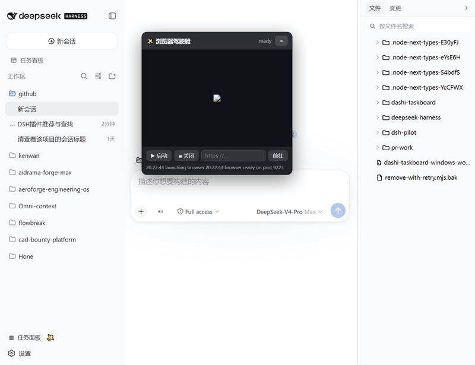

# 🛩️ dsh-pilot — 给你的 DSH agent 一双会开车的手

[](https://awesome-dsh-plugin.com) [English](README.md) · [DeepSeek Harness](https://github.com/deepseek-ai/deepseek-harness) 插件

让 agent 在 DSH 对话里**操控真实浏览器**：打开网页、把页面当结构化文本读（带**编号元素列表**）、按**编号**点击输入（不用猜 CSS）、按键、后退/刷新/等待、执行 JS、截图——你在 Web GUI 的可拖拽**驾驶舱面板**里实时围观，随时接管。

- 🚀 **一条命令安装** —— `dsh plugin --profile web add github:guo6x/dsh-pilot`
- ⚡ **零运行时依赖** —— 走 Node ≥ 22 原生 WebSocket 直连 CDP，用你机器上已有的 Edge/Chrome
- 🔑 **无需 API key** —— 什么都不出本机，不需要视觉模型
- 📖 **文本优先设计** —— agent 读的是 DOM 快照（标题/URL/正文/链接 + 编号元素），**纯文本模型**照样上网，不烧视觉 token
- 🎯 **按编号交互** —— 点击/输入全部指向快照编号，过期编号报错并提示重取快照
- 🧭 **完整导航套件** —— 后退、刷新、等待工具 + 内置页面落定等待，真实上网流程全覆盖
- 👀 **人在环中** —— 驾驶舱实时截图、地址栏、操作日志、会话指示，agent 的一举一动都看得见
- 🧩 **按会话隔离** —— 每个 agent 会话独立浏览器，并行会话互不抢页面

## 安装

```sh
dsh plugin --profile web add dsh-pilot
# 或从 GitHub 直装（同一份代码，锁定 commit）：
# dsh plugin --profile web add github:guo6x/dsh-pilot
```

重启 `dsh web`、刷新页面，侧边栏底部出现 ✈️ 按钮，点开即是驾驶舱。

要求：DSH web profile、Node ≥ 22、装了 Edge 或 Chrome。



## agent 得到的工具

| 工具 | 作用 |
|---|---|
| `pilot_open` | 打开网址（首次自动拉起浏览器），返回标题/URL/正文快照 |
| `pilot_snapshot` | 把当前页面读成文本：标题、URL、可见文本（8k 字符）、链接，以及**编号元素列表（refs）** |
| `pilot_click` | 按**快照编号**（或 CSS 选择器）点击元素，先滚动到可视区 |
| `pilot_type` | 按**快照编号**（或选择器）往输入框打字（原生 value setter，React/Vue 表单能感知） |
| `pilot_press` | 按键（Enter/Tab/Escape/方向键/单个字符） |
| `pilot_back` | 后退一页，等页面落定后返回 URL/标题 |
| `pilot_reload` | 刷新当前页，等页面落定 |
| `pilot_wait` | 等待 N 毫秒（1–30000），让异步内容加载完再动手 |
| `pilot_screenshot` | 存 PNG 并返回路径（给有视觉的模型或人看） |
| `pilot_eval` | 页面里执行 JS，拿 JSON 结果 |
| `pilot_close` | 关掉浏览器；下次调用自动重启 |

agent 直接用大白话说需求即可：*"打开登录页，填表，点提交，读出结果"* —— 工具动词和这句话一一对应。

## 人得到什么

可拖拽驾驶舱浮窗：实时截图（2 秒刷新）、当前 URL + 标题、启动/关闭按钮、地址栏、最近操作日志，多个会话同时开车时还有会话数指示。不想让它开了，一键关掉；想自己上手，随时接管。

## 已知限制

- **每会话单标签**：ref 编号绑定当前页面，切标签会让编号失效。需要第二个上下文？开个子代理——每个 agent 会话自带独立浏览器。
- **仅 headless**：驾驶舱显示的是 headless 画面，没有有头模式（人和 agent 同开一个浏览器是另一个产品）。
- **面板显示最近活跃会话的浏览器**：每个会话仍是独立实例，面板只是跟随最后动手的那个。

## 原理

```
DSH 对话 ──pilot_* 工具──▶ 宿主插件 ──CDP(原生 WebSocket)──▶ headless Edge/Chrome
    ▲                             │
    └── 结构化文本快照 ◀───────────┘
GUI 驾驶舱 ◀──/dsh-pilot/state + /dsh-pilot/shot.png（仅回环）──┘
```

- 以 headless 模式启动 `msedge`/`chrome`，独立 `--user-data-dir`（OS 临时目录），调试端口 9222 起动态选；停止时整棵进程树杀掉、临时 profile 删除。
- 宿主注册 8 个工具 + 仅回环的 HTTP API（`/dsh-pilot/*`，非回环客户端一律 403）。
- 客户端是注册在 `sidebar.footer.action` + `shell.overlay` 的小浮窗。

## 安全说明

- 浏览器以 **headless + 独立 profile** 运行，绝不碰你真实浏览器会话。
- HTTP API 只挂在 DSH 服务（默认回环地址），并显式拒绝非回环客户端。
- `pilot_open` 只收 http(s) URL；`pilot_eval` 在页面上下文执行 JS（相当于你自己开 DevTools——别让 agent 去你不信任的页面）。
- 无遥测、无第三方网络调用、无 API key。

## 开发

```sh
pnpm install
node build.mjs        # esbuild → lib/index.js（宿主 ESM）+ lib/client.js（ModuleLoader 包）
node tests/smoke.mjs  # 真 headless Edge 端到端冒烟测试
```

MIT 协议。发现问题或有好点子，直接提 issue。
